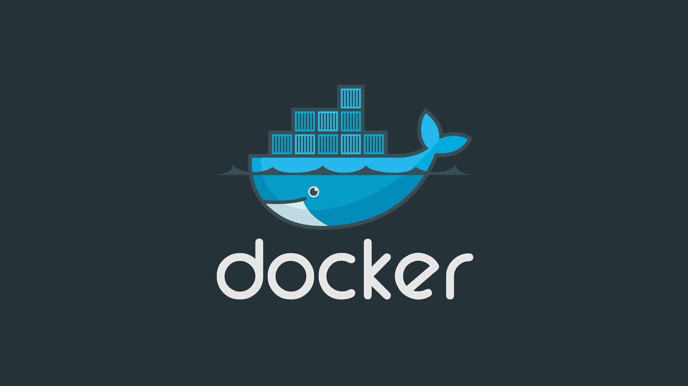
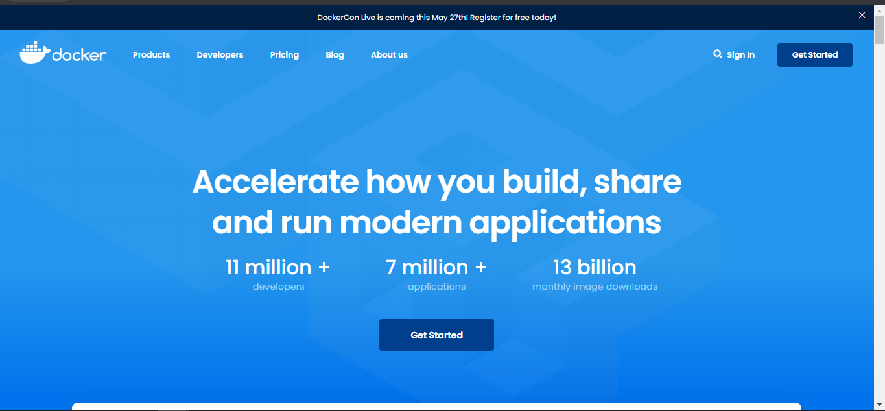

<h2 align="center">  Learn Docker | Containers using Interactive Browser Based Scenarios </h2>

<p align="center">
  
   </a>
    
  </a>
  <a href="https://github.com/BrianMarquez3/Docker-Course/stargazers">
    
  </a>
  <a href="https://github.com/BrianMarquez3/Docker-Course/network">
    
  </a>
    
  </a>
  
  </a>
    
  </a>
  
  </a>
    
  </a>
  
   </a>
   <a href="https://github.com/BrianMarquez3/Docker-Course/network">
    
  </a><br>
 
  
  
</P>

<table align="center" >
  <tr>
    <td align="center" style="padding=0;width=50%;">
      
    </td>
  </tr>
</table>

## Docker Linux (Ubuntu)

_Tutorial de Instalacion:_

Cómo instalar y usar Docker en Ubuntu 20.04 - [Docker en Ubuntu](https://www.digitalocean.com/community/tutorials/how-to-install-and-use-docker-on-ubuntu-20-04-es)


_Correcion de Error_

System has not been booted with systemd as init system (PID 1). Can't operate - [Systemctl](https://askubuntu.com/questions/1379425/system-has-not-been-booted-with-systemd-as-init-system-pid-1-cant-operate)

## Error Docker 

<table align="center" >
  <tr>
    <td align="center" style="padding=0;width=50%;">
      
    </td>
  </tr>
</table>


_Correcion del Error_

- Download the latest package:
https://docs.microsoft.com/en-us/windows/wsl/install-manual

<table align="center" >
  <tr>
    <td align="center" style="padding=0;width=50%;">
      
    </td>
  </tr>
</table>

If you're using an ARM64 machine, please download the ARM64 package instead. If you're not sure what kind of machine you have, open Command Prompt or PowerShell and enter: systeminfo | find "System Type". Caveat: On non-English Windows versions, you might have to modify the search text, for example, in German it would be systeminfo | find "Systemtyp".


## DockerHub

<table align="center" >
  <tr>
    <td align="center" style="padding=0;width=50%;">
      
    </td>
  </tr>
</table>

## Descargar

<table align="center" >
  <tr>
    <td align="center" style="padding=0;width=50%;">
      
    </td>
  </tr>
</table>

📦 [Install Docker - Windows ](https://www.docker.com/products/docker-desktop) Accelerate how you build, share and run modern applications.<br>

## Principales Comandos

_DockerFiles_

- Creador de imagenes


_Descargar una imagen de postgre 9.6_

```js
docker run postgres:9.6
```
 
## Comandos Comunes

_Permite correr un contenedor_

```js
docker run
```

_Permite descargar imagen y no correr_

```js
docker pull
```

_Permite ver la imagenes_

```js
docker images | head
```

_Suprimir el Sudo del principio_

```js
sudo usermod -aG docker ${USER}
```

```js
su - ${USER}
```

_Permite ver los contenedores corriendo_

```js
docker ps
```

_Permite ver los contenedores que corriendo hace un tiempo_

```js
docker ps -a
```

_Permite recuperar los datos de un contenedor_

```js
docker start ContainerID
```

_Ver los Logs_

```js
docker log ContainerID
```

_Eliminar Contenedor_

```js
docker rmi Idcontainer
```

_Ejecutar comando en un Docker en funcionamiento_

```js
docker exec -it ContainerID sh
- ls   
```

_Detener contenedor_

```js
docker stop ContainerID
```


_Ejecutar en Backbround_

```js
docker run -d nombre
```

 
## Comandos en casos de proyectos

dentro de la careta donde se tien un proyecto!

```js
vim Dockerfile
```

_Ejemplo_

```js
FROM node:12.22.1-alpine3.11

WORKDIR /app
COPY . .
RUN yarn install --production

CMD ["node", "/app/src/index.js"]
```


## Docker Hub

_Ejemplo_

```js
docker pull node
```

```js
docker pull alpine
```

## Construccion del Contenedor

```js
docker build -t getting-started
```

## Ejecutar

```js
docker run -dp 3000:3000 getting-started
```

## Guardar un contenedor

```js
sudo docker run -d -v /home/brian/Documents/Docker/etc/etc:/etc/todos -p 3000:3000 getting-started
```

- Detener y volver a ejecutar, se guardaraon los cambios 
- ir a [localhost:3000](http://localhost:3000)


## Reconstruir Imagen Docker

```js
sudo docker run -d -v /home/brian/Documents/Docker/etc/etc:/etc/todos -p 3000:3000 getting-started
```


## Ventajas de los contenedores Docker

- Modularidad
- Control de versiones de imágenes y capas
- Restauración
- Implementación rápida

## Spotify 

🎵 Music [List on Spotify 🎤](https://open.spotify.com/playlist/1UMfu4axebdOMeM996K0xP?si=A-pW9orFSRegxZBWoMZp4w)

## Paypal Donation

🩸 Hacer una donación [PAYPAL](https://www.paypal.com/donate?hosted_button_id=98U3T62494H9Y) 🍵

---

## Hay limitaciones para el uso de Docker

En sí mismo, Docker es una excelente herramienta para la gestión de contenedores individuales. Al comenzar a utilizar cada vez más contenedores y aplicaciones en contenedores, divididas en cientos de piezas, la gestión y la organización se pueden tornar muy difíciles. Finalmente, debe retroceder y agrupar los contenedores para ofrecer servicios, como redes, seguridad, telemetría, etc., en todos sus contenedores. Es aquí donde aparece Kubernetes.

---

 <table align="center">
    <tr>
      <td colspan="3">A</td>
        <td>B</td>
      </tr>
      <tr>
        <td>C</td>
      <td colspan="2"></td>
        <td>E</td>
      </tr>
      <tr>
      <td colspan="3">F</td>
        <td>G</td>
    </tr>
</table>


