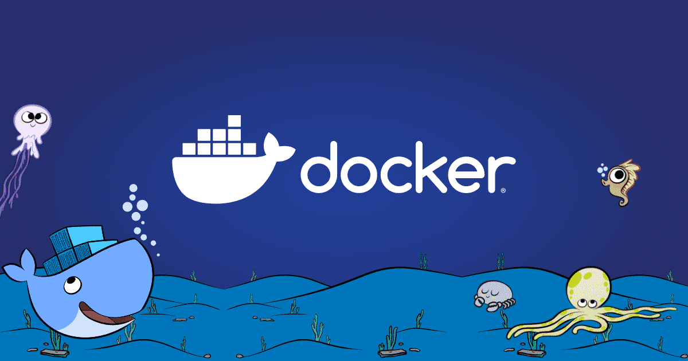
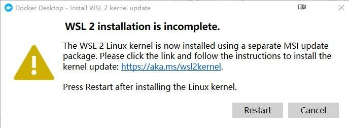
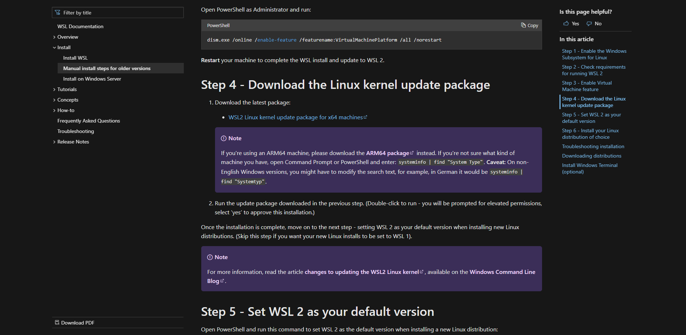
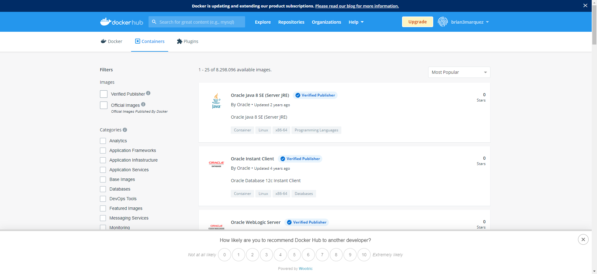

<h2 align="center">  Learn Docker | Containers using Interactive Browser Based Scenarios </h2>

<p align="center">
  
  </a>
    
  </a>

  <a href="https://github.com/BrianMarquez3/Docker-Course/stargazers">
    
  </a>

  <a href="https://github.com/BrianMarquez3/Docker-Course/network">
    
  </a>

  </a>
    
  </a>
  
  </a>
    
  </a>
  
  </a>
    
  </a>
  
   </a>
   <a href="https://github.com/BrianMarquez3/Docker-Course/network">
    
  </a><br>
 
  
  
</p>

<table align="center" >
  <tr>
    <td align="center" style="padding=0;width=50%;">
      
    </td>
  </tr>
</table>

## Install


📦 [Install Docker en Ubuntu](https://www.digitalocean.com/community/tutorials/how-to-install-and-use-docker-on-ubuntu-20-04-es) Develop faster.
Run anywhere. <br> 
📦 [Install Docker en Windows ](https://www.docker.com/products/docker-desktop) Accelerate how you build, share and run modern applications.<br>
📦 [Install Docker Compose en Ubuntu](https://www.digitalocean.com/community/tutorials/how-to-install-and-use-docker-compose-on-ubuntu-20-04) Accelerate how you build, share and run modern applications.<br>

**Inicializar Docker Ubuntu**

```bash
service docker start
```

```bash
service docker status
```

H```bash
service docker stop
```

## Correcion del Error - Instalaccion

<table align="center" >
  <tr>
    <td align="center" style="padding=0;width=50%;">
      
    </td>
  </tr>
</table>

System has not been booted with systemd as init system (PID 1). Can't operate - [Systemctl](https://askubuntu.com/questions/1379425/system-has-not-been-booted-with-systemd-as-init-system-pid-1-cant-operate)

- Download the latest package:
https://docs.microsoft.com/en-us/windows/wsl/install-manual

<table align="center" >
  <tr>
    <td align="center" style="padding=0;width=50%;">
      
    </td>
  </tr>
</table>

If you're using an ARM64 machine, please download the ARM64 package instead. If you're not sure what kind of machine you have, open Command Prompt or PowerShell and enter: systeminfo | find "System Type". Caveat: On non-English Windows versions, you might have to modify the search text, for example, in German it would be systeminfo | find "Systemtyp".

```bash
wsl --set-default-version 1
```

## DockerHub

<table align="center" >
  <tr>
    <td align="center" style="padding=0;width=50%;">
      
    </td>
  </tr>
</table>

* Tutorial Docker

[Tutorial Docker ](https://www.digitalocean.com/community/tutorials/how-to-install-and-use-docker-on-ubuntu-20-04-es) - Cómo instalar y usar Docker en Ubuntu 20.04

## Images Docker


_DockerFiles_

- Creador de imagenes

_Descargar una imagen de postgre 9.6_

```
docker run postgres:9.6
```
 
## Comandos Comunes

_Version de Docker_

```
docker --version
```
_Version de Docker compose_

```
docker-compose --version
```

_Permite correr un contenedor_

```
docker run
```

_Permite descargar imagen y no correr_

```
docker pull
```

_Permite ver la imagenes_

```
docker images | head
```

_Suprimir el Sudo del principio_

```
sudo usermod -aG docker ${USER}
```

```
su - ${USER}
```

_Permite ver los contenedores corriendo_

```
docker ps
```

_Permite ver los contenedores que corriendo hace un tiempo_

```
docker ps -a
```

_Permite recuperar los datos de un contenedor_

```
docker start ContainerID
```

_Ver los Logs_

```
docker log ContainerID
```

_Eliminar Contenedor_

```
docker rmi Idcontainer
```

_Ejecutar comando en un Docker en funcionamiento_

```
docker exec -it ContainerID sh
- ls   
```

_Detener contenedor_

```
docker stop ContainerID
```


_Ejecutar en Backbround_

```
docker run -d nombre
```

_Contruir Imagen_

```yaml
docker build -t devrrior/docker-django .
```

_Correr Imagen_

```yaml
docker run -p 8000:8000 devrrior/docker-djando
```

_Correr sin log_

```yaml
docker run -d -v /home/briandb/docker-django/:/app -p 8000:8000 devrrior/docker-django
```
[5704613836e41711efa45f5e875257c6bae734e68b18668f022040d3fd8133e7]

_Correr con Log_

```yaml
docker logs --follow 5704613836e41711efa45f5e875257c6bae734e68b18668f022040d3fd8133e7
```

_Entrar al contenedor_

```yaml
 docker exec -it 5704613836e41711efa45f5e875257c6bae734e68b18668f022040d3fd8133e7 /bin/sh
```

_Volumenes_

```yaml
docker run -v /home/briandb/docker-django/:/app -p 8000:8000 devrrior/docker-django
```
 
## Comandos en casos de proyectos

dentro de la careta donde se tien un proyecto!

```
vim Dockerfile
```

_Ejemplo_

```
FROM node:12.22.1-alpine3.11

WORKDIR /app
COPY . .
RUN yarn install --production

CMD ["node", "/app/src/index.js"]
```


## Docker Hub

_Ejemplo_

```
docker pull node
```

```
docker pull alpine
```

## Construccion del Contenedor

```
docker build -t getting-started
```

## Ejecutar

```
docker run -dp 3000:3000 getting-started
```

## Guardar un contenedor

```
sudo docker run -d -v /home/brian/Documents/Docker/etc/etc:/etc/todos -p 3000:3000 getting-started
```

- Detener y volver a ejecutar, se guardaraon los cambios 
- ir a [localhost:3000](http://localhost:3000)


## Reconstruir Imagen Docker

```js
sudo docker run -d -v /home/brian/Documents/Docker/etc/etc:/etc/todos -p 3000:3000 getting-started
```


## Spotify 

🎵 Music [List on Spotify 🎤](https://open.spotify.com/playlist/1UMfu4axebdOMeM996K0xP?si=A-pW9orFSRegxZBWoMZp4w)

## Paypal Donation

🩸 Hacer una donación [PAYPAL](https://www.paypal.com/donate?hosted_button_id=98U3T62494H9Y) 🍵

---

 <table align="center">
    <tr>
      <td colspan="3">A</td>
        <td>B</td>
      </tr>
      <tr>
        <td>C</td>
      <td colspan="2"></td>
        <td>E</td>
      </tr>
      <tr>
      <td colspan="3">F</td>
        <td>G</td>
    </tr>
</table>
